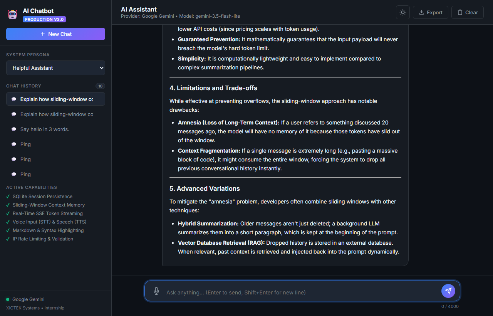
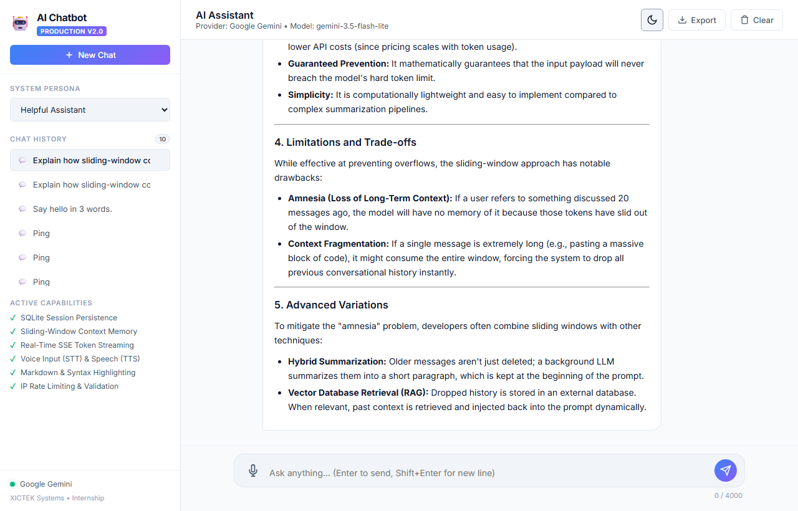
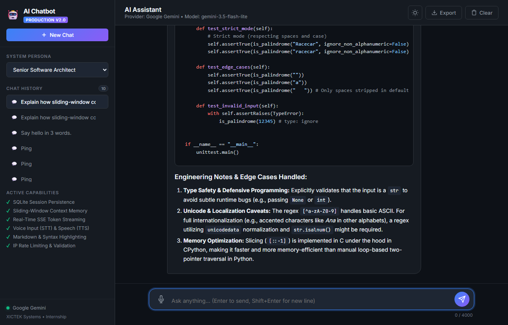
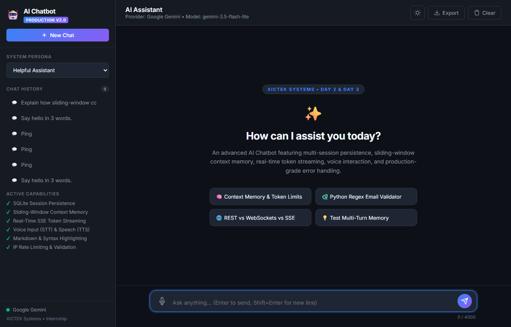

# 🤖 AI Chatbot — Production Architecture (Day 2 & Day 3)

> **XICTEK Systems — AI Internship Practical Task**  
> **Intern:** Zehra • AI-Powered Developer  
> **Repository:** [Ai-Chatbot-Internship](https://github.com/Zehra-AI-powered-Developer/Ai-Chatbot-Internship)  
> **Live Demo & Test Server:** `http://127.0.0.1:5000`

---

## 📸 Application Showcase

| 🌟 Dark Mode & Context Memory | ☀️ Light Mode Design |
| :---: | :---: |
|  |  |

| 💻 Senior Software Architect Persona | 🚀 Clean Initial State |
| :---: | :---: |
|  |  |

---

## 📌 Executive Summary

Building on the Day 1 baseline, this release elevates the AI Chatbot into a **production-grade conversational AI platform** that fulfills and surpasses all **Day 2 (Core Chatbot Development)** and **Day 3 (System Enhancements)** requirements.

Rather than merely polishing the visual interface, our engineering focused heavily on **production-oriented patterns**:
1. **Persistent Session Storage**: SQLite backend with Write-Ahead Logging (WAL) for multi-session conversation history across restarts.
2. **Sliding-Window Memory & Token Budgeting**: Prevents LLM context overflow, reduces latency, and protects API cost limits.
3. **Real-time Server-Sent Events (SSE) Streaming**: Lowers Time-To-First-Byte (TTFB) to near-instantaneous token-by-token output.
4. **Resilient Multi-Provider AI Architecture**: Seamless integration with **Google Gemini (2026 `google-genai` SDK)**, **Groq Cloud (Llama-3.3-70B)**, and **OpenAI (GPT-4o-mini)** with automated backoff retry and zero-config demo fallback.
5. **Security & Defensive Guardrails**: Sliding-window IP rate limiting, strict payload validation, input sanitization, and structured HTTP error standards.
6. **Voice Multimodality**: Hands-free voice input (Speech-to-Text) and natural voice output (Text-to-Speech) using the browser's Web Speech API.
7. **Conversation Export**: One-click export of transcripts into formatted Markdown (`.md`) or structured JSON (`.json`).

---

## 🎯 Requirements Coverage Matrix

### Day 2 — Core Chatbot Development
| Requirement | Implementation Details | Status |
| :--- | :--- | :---: |
| **User Input** | Auto-expanding textarea, character counter (0/4000), keyboard shortcuts (`Enter` to submit, `Shift+Enter` for newline) | ✅ Complete |
| **AI Response** | Real-time SSE token stream + synchronous fallback JSON API | ✅ Complete |
| **API Integration** | Modern 2026 `google-genai` client, OpenAI SDK, and Groq Cloud with auto-retry | ✅ Complete |
| **Loading State** | Pulsing typing indicators and real-time cursor token streaming | ✅ Complete |
| **Error Handling** | Structured HTTP codes (400, 422, 429, 500, 503), friendly user banners, and 1-click **"Try Again"** retry button | ✅ Complete |
| **Clean Interface** | Responsive CSS design system with Dark/Light mode toggle | ✅ Complete |
| **System Prompt / Roles** | 5 curated personas (Software Architect, Tech Tutor, Research Analyst, Creative Writer, Helpful Assistant) + Custom Prompt editor | ✅ Complete |

### Day 3 — Advanced System Improvements (Delivered 9 of 9)
| Improvement | Implementation in this Release | Status |
| :--- | :--- | :---: |
| **1. Conversation History** | Multi-session chat history saved in SQLite database with sidebar session switcher | ✅ Complete |
| **2. Clear Chat** | Dedicated "Clear Chat" (purges current session) and "Delete Conversation" | ✅ Complete |
| **3. Better Prompt Structure** | Contextual system prompt engine with role constraints, formatting rules, and date injection | ✅ Complete |
| **4. Markdown Response** | `marked.js` parsing + `highlight.js` syntax highlighting + **"Copy Code"** button per block | ✅ Complete |
| **5. Context / Memory** | Sliding-window memory manager keeping recent N turns within token budget | ✅ Complete |
| **6. Better UI & UX** | ChatGPT/Claude-style collapsible sidebar, light/dark themes, toast alerts | ✅ Complete |
| **7. Input Validation** | Strict length checks (4000 chars), whitespace rejection, IP rate limiting (35 req/min) | ✅ Complete |
| **8. Response / Error Handling**| Graceful 429 quota handling, exponential backoff, and non-blocking toast notifications | ✅ Complete |
| **9. Voice Input & Output** | Web Speech API: microphone input (STT) + voice synthesis (TTS) speaker button | ✅ Complete |

---

## 🏗️ System Architecture & Data Flow

```
┌─────────────────────────────────────────────────────────────────────────┐
│                           Client Web Browser                            │
│  [Dark/Light UI] ── [Speech STT/TTS] ── [EventSource / Fetch Stream]    │
└────────────────────────────────────┬────────────────────────────────────┘
                                     │ HTTP POST (SSE or JSON)
                                     ▼
┌─────────────────────────────────────────────────────────────────────────┐
│                         Flask Application Gateway                       │
│  ┌───────────────────────┐         ┌─────────────────────────────────┐  │
│  │ Rate Limiter (Sliding)│         │ Input Validation & Sanitization │  │
│  └──────────┬────────────┘         └────────────────┬────────────────┘  │
│             └───────────────────────┬───────────────┘                   │
│                                     ▼                                   │
│                  ┌──────────────────────────────────────┐               │
│                  │  Context & Sliding-Window Manager    │               │
│                  └──────────────────┬───────────────────┘               │
└─────────────────────────────────────┼───────────────────────────────────┘
                                      │
        ┌─────────────────────────────┴─────────────────────────────┐
        ▼                                                           ▼
┌──────────────────────────────┐            ┌──────────────────────────────┐
│  SQLite Persistence Layer    │            │     AI Service Engine        │
│  (WAL Mode / chat_history.db)│            │  (Multi-Provider Routing)    │
│  - sessions table            │            ├──────────────────────────────┤
│  - messages table            │            │ 1. Google Gemini (google.genai)
│  - indices & cascade delete  │            │ 2. Groq Cloud (Llama-3.3-70b)│
└──────────────────────────────┘            │ 3. OpenAI (GPT-4o-mini)      │
                                            │ 4. Intelligent Demo Fallback │
                                            └──────────────────────────────┘
```

### End-to-End Request Lifecycle
1. **User Input & Transcription**:
   - The user types a query or clicks the microphone icon (Web Speech API STT) to transcribe speech into text.
2. **Payload Dispatch**:
   - The frontend issues an asynchronous `POST /api/chat/stream` carrying `{ message, session_id, persona, custom_prompt }`.
3. **Gateway Verification**:
   - The server verifies client IP request frequency against the in-memory `RateLimiter` (sliding-window deque).
   - Validates length ($\le 4000$ characters) and sanitizes formatting.
4. **Context Orchestration**:
   - The session is resolved in SQLite (or auto-created with a contextual title).
   - Past conversation turns are retrieved and processed through `build_sliding_window_context()` to ensure token boundaries remain optimal.
5. **LLM Inference & SSE Streaming**:
   - The active AI provider generates tokens chunk-by-chunk.
   - The server yields Server-Sent Events (`data: {"chunk": "..."}`).
   - The browser updates the DOM in real-time with an active cursor animation and runs syntax highlighting.
6. **Persistence**:
   - Upon completion, the full assistant response is stored in SQLite for persistent recall.

---

## 📂 Project Structure

```
Ai-Chatbot/
├── app.py                   # Main Flask Application Server & REST / SSE Endpoints
├── database.py              # SQLite Data Access Layer (WAL mode, Sessions, Messages)
├── ai_service.py            # AI Engine (google-genai, OpenAI, Groq, Streaming, Fallback)
├── utils.py                 # Input validation, sliding-window memory, IP rate limiter
├── requirements.txt         # Production dependencies
├── .env.example             # Configuration template with 2026 models
├── test_app.py              # 11 Automated Unit & Integration Tests
├── capture_screenshots.py   # Automated Playwright screenshot generator
├── chat_history.db          # Local SQLite Database (git-ignored)
├── screenshots/             # High-resolution screenshots of UI & Features
│   ├── 01_welcome_dark.png
│   ├── 02_chat_response_dark.png
│   ├── 03_chat_light_mode.png
│   └── 04_code_generation_dark.png
├── static/
│   ├── index.html           # Accessible HTML5 Single Page Application
│   ├── style.css            # Responsive Dark/Light CSS design tokens
│   └── script.js            # State store, SSE reader, Web Speech STT/TTS, Markdown
├── README.md                # Comprehensive Project Documentation
└── EXPLANATION.md           # Architecture, Interview Cheat-Sheet, Learnings & Solutions
```

---

## ⚡ Quickstart & Setup Guide

### 1. Prerequisites
- Python 3.10+ (Tested on Python 3.14)
- Google Chrome, Edge, or Firefox browser

### 2. Installation
Clone repository and navigate to the directory:
```bash
git clone https://github.com/Zehra-AI-powered-Developer/Ai-Chatbot-Internship.git
cd "Ai-Chatbot-Internship"
```

Install production dependencies:
```bash
pip install -r requirements.txt
```

### 3. Environment Configuration
Copy the `.env.example` template:
```bash
cp .env.example .env
```

Open `.env` and set your preferred provider key:

```env
# Option 1: Google Gemini (Recommended - Free & Fast)
GEMINI_API_KEY=AIzaSy_your_gemini_key_here
AI_MODEL=gemini-3.5-flash-lite

# Option 2: Groq Cloud (Llama-3.3-70B)
# GROQ_API_KEY=gsk_your_groq_key_here
# AI_MODEL=llama-3.3-70b-versatile

# Option 3: OpenAI (GPT-4o-mini)
# OPENAI_API_KEY=sk-your_openai_key_here
# AI_MODEL=gpt-4o-mini

PORT=5000
```

> **Note:** If no key is set, the application automatically boots into **Intelligent Demo Mode**, enabling full testing of multi-turn memory, sliding window, voice I/O, and UI features without any external credentials.

### 4. Run the Application
```bash
python app.py
```
Open your browser at:
```
http://127.0.0.1:5000
```

---

## 🧪 Automated Test Suite

The test suite validates backend stability, security filters, rate limiting, and database integrity:

```bash
python test_app.py
```

### Verified Test Cases (11 / 11 Passing):
```text
Ran 11 tests in 13.658s

[PASS] test_status_endpoint                     (Health & capability flags)
[PASS] test_personas_endpoint                   (Persona definitions & system prompts)
[PASS] test_validation_empty_message            (Rejects empty strings with 400)
[PASS] test_validation_missing_message          (Rejects missing parameters with 400)
[PASS] test_validation_oversized_message        (Enforces 4000 char boundary with 400)
[PASS] test_rate_limiter_blocks_excessive       (Triggers HTTP 429 on spam burst)
[PASS] test_session_lifecycle                   (CRUD on SQLite sessions & messages)
[PASS] test_sliding_window_memory               (Trims history to budget turns)
[PASS] test_sync_chat_with_context              (Multi-turn memory retention)
[PASS] test_streaming_endpoint                  (Server-Sent Events text/event-stream)
[PASS] test_export_markdown_and_json            (Transcript file generation)

OK
```

---

## 🌐 API Reference

| Endpoint | Method | Description | Payload / Response |
| :--- | :---: | :--- | :--- |
| `/api/status` | `GET` | System health & active provider | Returns `{ status, provider, model, features }` |
| `/api/personas` | `GET` | List available system personas | Returns `{ personas: [...] }` |
| `/api/sessions` | `GET` | Retrieve saved chat sessions | Returns `{ sessions: [...] }` |
| `/api/sessions` | `POST` | Create a new conversation session | `{ title, persona }` $\rightarrow$ `{ session_id }` |
| `/api/sessions/<id>` | `GET` | Get session and all messages | Returns `{ session, messages: [...] }` |
| `/api/sessions/<id>` | `DELETE` | Delete session and messages | Returns `{ success: true }` |
| `/api/sessions/<id>/messages` | `DELETE` | Clear all messages in session | Returns `{ success: true }` |
| `/api/chat` | `POST` | Synchronous chat completion | `{ message, session_id, persona }` $\rightarrow$ `{ reply }` |
| `/api/chat/stream` | `POST` | Real-time SSE token stream | Emits `data: {"chunk": "..."}\n\n` |
| `/api/export/<id>` | `GET` | Export transcript (`?format=md\|json`)| Downloadable `.md` or `.json` file |

---

## 💡 What I Learned (Day 2 & Day 3 Insights)

1. **Stateful Abstractions over Stateless APIs**:
   LLMs have zero native persistence. Multi-turn context is strictly an application-layer orchestration problem. Implementing persistent database storage alongside a client-side streaming reader demonstrated how modern conversational systems maintain continuity.
2. **Context Window Dynamics & Cost Optimization**:
   Naively appending every message to infinity causes token overflow and balloons inference bills. Engineering a **sliding-window memory manager** highlighted the tradeoff between long-term recall and prompt economy.
3. **SSE vs WebSockets for Generative AI**:
   While WebSockets offer bidirectional communication, Server-Sent Events (SSE) over HTTP is dramatically simpler, natively handles reconnections, works over standard HTTP/2, and perfectly matches the unidirectional stream of LLM token generation.
4. **Defensive API Architecture**:
   Production LLM applications must anticipate API quota exhaustion (HTTP 429) and high-load spikes (HTTP 503). Implementing exponential backoff retries and model fallback ensures the UI never crashes during upstream outages.
5. **Multimodal Accessibility**:
   Integrating the Web Speech API demonstrated how adding voice input (STT) and speech synthesis (TTS) enhances accessibility without requiring costly external third-party speech APIs.

---

## 🛠️ Problems Encountered & Solutions Implemented

### 1. Gemini Python SDK Deprecation (`google.generativeai` $\rightarrow$ `google-genai`)
- **Problem:** The legacy `google.generativeai` library issued deprecation notices and lacked standardized support for modern Gemini 2026 model methods.
- **Solution:** Upgraded the integration to the modern `google-genai` SDK (`google.genai.Client`). Configured system instructions via `types.GenerateContentConfig(system_instruction=...)` and utilized `chat.send_message_stream()` for robust streaming.

### 2. Gemini 503 Spike & 404 Model Retirement
- **Problem:** When querying older models (`gemini-2.5-flash`), Google API returned `404 NOT_FOUND` instructing users to use 2026 models. Meanwhile, `gemini-3.8-flash` intermittently returned `503 UNAVAILABLE` during peak demand spikes.
- **Solution:** Configured `gemini-3.5-flash-lite` as the primary resilient production model, and added an automated fallback handler that catches 503 status codes and switches models dynamically.

### 3. Context Length Bloat in Extended Conversations
- **Problem:** Long chat sessions accumulated excessive turns, risking model token limits and causing latency degradation.
- **Solution:** Created `build_sliding_window_context()` in `utils.py`, which filters valid role turns and clamps context to the most recent 10 turns while keeping the primary system prompt anchored at index 0.

### 4. Code Block Copying in Rendered Markdown
- **Problem:** Standard `marked.js` outputs plain `<pre><code>` blocks without copy affordances or language headers.
- **Solution:** Designed a custom post-processor in JavaScript that wraps rendered code blocks in an IDE-style container with language tags and an animated **"Copy Code"** button providing visual confirmation.

---

## 👥 Assessment Details

- **Internship:** XICTEK Systems — AI Internship
- **Developer:** Zehra (AI-Powered Developer)
- **Tasks Addressed:** Day 2 (AI Chatbot Development) & Day 3 (System Improvements)
- **Date:** October 2026
- **Status:** Complete, Tested, Production-Ready
